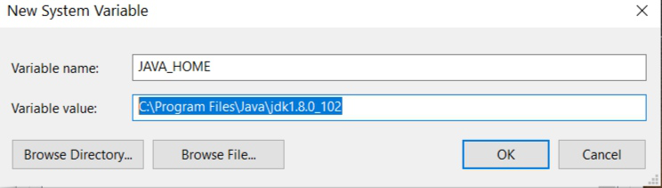

AIRPORT ASSESSMENT
==================

This console program is able to perform two operations on the CSVs files:  
* Display runways for each airport given a country code or country name using airports.csv, countries.csv and runways.csv.  
In the provided files in src/main/resources/ the country code is specified as a **two letter ISO code** (ex: ES for Spain) and the country name is the english country name  
* Display the top 10 countries with the most airports using **airports.csv** and **countries.csv**  
  
    

Requirements  
------------  
  
This program is written in Java 8, as such, Java must be installed in the machine where is intended to build or run this program.  
The Java Development Kit may be downloaded in the following link for any platform: 
[https://www.oracle.com/es/java/technologies/downloads/#java8](https://www.oracle.com/es/java/technologies/downloads/#java8)  

Alternatively, Linux users may prefer to install Java through the command line:  

> `apt install openjdk-8-jdk-headless`

This command might require root permissions.  

To make Java available in the command line, it must be included in the system PATH. This procedure varies between operating systems.  

For Windows:
  1. Press the shortcut **[Win + R]**, write `sysdm.cpl` in the dialog that will appear and press **[ENTER]**.
  In the case you are asked to provide administrator permissions, accept.
  2. Go to the tab **'Advanced'** and click the button **'Environment Variables...'** 
  3. It will appear a menu with two lists of environment variables.  
  To add Java to the system variables, press the bottom **'New...'** button
  and write `JAVA_HOME` as the variable name and the route where the JDK is installed as the value,
  which will be located in **C:\Program Files\Java\** unless specified otherwise during installation.  
  As JDK version numbers vary depending on the current release, you are needed to check which version you do have.  
  For the current release, the variable value would be `C:\Program Files\Java\jdk1.8.0_341`.  
  When finished, press the **'Accept'** button.  
  4. Find the **'Path'** variable, select it and edit it through the **'Edit'** button.  
  In the menu that will appear, press the new Button and enter the following text `%JAVA_HOME%\bin`  
  Use the **'Accept'** button in each menu to close all the menus.  
  5. Restart all consoles for the changes to take effect.  
  
  
    
  
  
For Linux:
 1. Add the following lines to the file /etc/profile  
`export JAVA_HOME="/usr/lib/jvm/java-1.8.0-openjdk-amd64"`  
`export PATH=$JAVA_HOME/bin:$PATH`  
 2. Reboot or run `source /etc/profile` to apply the changes  

Build
-----

To build the program, it may be build with any tool of your liking or through the `build.bat` script for Windows
or `build.sh` for Linux while being located on the same folder as the script.

Usage
-----

This program may be run through the `airport.bat` script in Windows or `airport.sh` in Linux.

It may be run in two modes, **interactive mode** and **command mode**.  
Interactive mode lets you interact with the program as a client, while command mode lets you provide
all CSVs and the country which to check the airport and runways in a single order.  

To execute the program in interactive mode, run the `airport` script with no arguments.
You will then be asked to provide the route where the CSV files (airports.csv, countries.csv and runways.csv in that order) are located.  
A folder may be specified instead of a file, which will make the program look for 'airports.csv', 'countries.csv' and 'runways.csv' inside 
that folder to use them as the CSV sources for Airports, Countries and Runways respectively.  

Following that, the menu will appear asking for the action to perform

  

In the command mode, it is required to pass the routes and country code as parameters,
then the program will calculate the top 10 countries with most airports and show the runways for each airport in the specified country.  

Once again, the route may specify a folder where the program will look for the .csv files.  
> `airport <airportsCSVRoute> <countriesCSVRoute> <runwaysCSVRoute> <country>` 

  

Both interactive mode and command mode don't use runwayCSVRoute in the top 10 feature so it
is safe to use even if it is malformed.

Constraints
-----------  
 
 All .csv intended to be used in this program must be comma separated and have the first line as the header    
* In specific .csv, the following columns must be included in the header :    
    * For **airport.csv**: `iso_country`, `id`, `name`    
    * For **countries.csv**: `code`, `name`  
    * For **runways.csv**: `airport_ref`, `id`  
